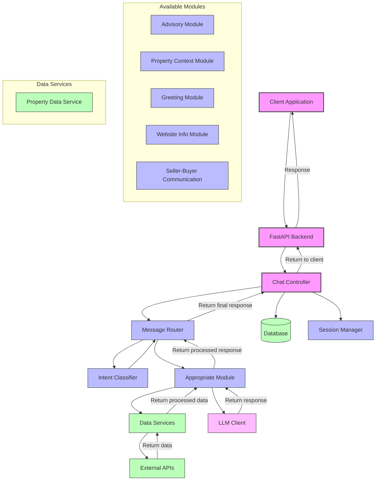

```mermaid
graph TD
    %% Main Flow
    Client[Client Application] --> API[FastAPI Backend]
    API --> Controller[Chat Controller]
    Controller --> Router[Message Router]
    Router --> Classifier[Intent Classifier]
    Classifier --> Router
    
    %% Module Selection (simplified)
    Router --> Modules[Appropriate Module]
    Modules --> DataServices[Data Services]
    DataServices --> ExternalAPIs[External APIs]
    ExternalAPIs --"Return data"--> DataServices
    DataServices --"Return processed data"--> Modules
    Modules --> LLM[LLM Client]
    LLM --"Return response"--> Modules
    Modules --"Return processed response"--> Router
    Router --"Return final response"--> Controller
    Controller --"Return to client"--> API
    API --"Response"--> Client
    
    %% Database Connection
    Controller --> Database[(Database)]
    Controller --> SessionManager[Session Manager]
    
    %% Module Types (listed separately)
    subgraph "Available Modules"
        Module1[Advisory Module]
        Module2[Property Context Module]
        Module3[Greeting Module]
        Module4[Website Info Module]
        Module5[Seller-Buyer Communication]
    end
    
    %% Data Services (listed separately)
    subgraph "Data Services"
        Service1[Property Data Service]
    end
    
    %% Styling
    classDef primary fill:#f9f,stroke:#333,stroke-width:2px
    classDef secondary fill:#bbf,stroke:#333,stroke-width:1px
    classDef data fill:#bfb,stroke:#333,stroke-width:1px
    classDef llm fill:#fbf,stroke:#333,stroke-width:1px
    
    class Client,API,Controller primary
    class Router,Classifier,Modules,Module1,Module2,Module3,Module4,Module5,SessionManager secondary
    class Database,DataServices,Service1,ExternalAPIs data
    class LLM llm
``` 