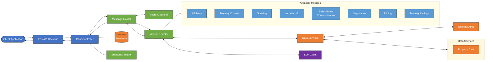

```mermaid
flowchart LR
    %% Core components with improved layout
    Client([Client Application]):::primary --> API[FastAPI Backend]:::primary
    API --> Controller[Chat Controller]:::primary
    Controller --> Router[Message Router]:::secondary
    Router <--> Classifier[Intent Classifier]:::secondary
    
    %% Database connections
    Controller --- DB[(Database)]:::data
    Controller --- Session[Session Manager]:::secondary
    
    %% Module selection and processing
    Router --> Modules[Module Selector]:::secondary
    
    %% External integrations
    Modules <--> DataSvc[Data Services]:::data
    DataSvc <--> ExtAPI[External APIs]:::data
    Modules <--> LLM[LLM Client]:::llm
    
    %% Return flow
    Modules --> Router
    Router --> Controller
    Controller --> API
    API --> Client
    
    %% Available modules in a cleaner subgraph
    subgraph ModuleTypes[Available Modules]
        direction TB
        Advisory[Advisory]:::module
        PropContext[Property Context]:::module
        Greeting[Greeting]:::module
        WebInfo[Website Info]:::module
        CommModule[Seller-Buyer<br>Communication]:::module
        Negotiation[Negotiation]:::module
        Pricing[Pricing]:::module
        Listings[Property Listings]:::module
    end
    
    %% Set background color for the modules subgraph
    style ModuleTypes fill:#FFFDE7,stroke:#E0E0E0
    
    %% Connect modules to the module selector
    Modules --- ModuleTypes
    
    %% Data services in a clean subgraph
    subgraph DataServices[Data Services]
        PropData[Property Data]:::data
    end
    
    %% Set background color for the data services subgraph
    style DataServices fill:#FFF8E1,stroke:#E0E0E0
    
    %% Connect data services
    DataSvc <--> DataServices
    
    %% Styling to match the provided image colors
    classDef primary fill:#4472C4,stroke:#333,color:#FFF,stroke-width:1px
    classDef secondary fill:#70AD47,stroke:#333,color:#FFF,stroke-width:1px
    classDef data fill:#ED7D31,stroke:#333,color:#FFF,stroke-width:1px
    classDef llm fill:#7030A0,stroke:#333,color:#FFF,stroke-width:1px
    classDef module fill:#5B9BD5,stroke:#333,color:#FFF,stroke-width:1px
``` 