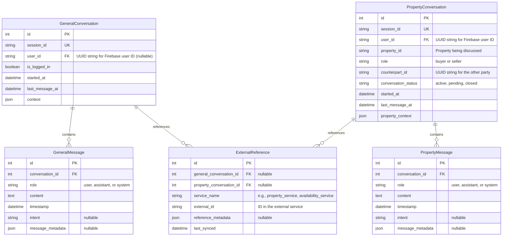

```mermaid
erDiagram
    GeneralConversation ||--o{ GeneralMessage : contains
    GeneralConversation ||--o{ ExternalReference : references
    PropertyConversation ||--o{ PropertyMessage : contains
    PropertyConversation ||--o{ ExternalReference : references

    GeneralConversation {
        int id PK
        string session_id UK
        string user_id FK "UUID string for Firebase user ID (nullable)"
        boolean is_logged_in
        datetime started_at
        datetime last_message_at
        json context
    }

    GeneralMessage {
        int id PK
        int conversation_id FK
        string role "user, assistant, or system"
        text content
        datetime timestamp
        string intent "nullable"
        json message_metadata "nullable"
    }

    PropertyConversation {
        int id PK
        string session_id UK
        string user_id FK "UUID string for Firebase user ID"
        string property_id "Property being discussed"
        string role "buyer or seller"
        string counterpart_id "UUID string for the other party"
        string conversation_status "active, pending, closed"
        datetime started_at
        datetime last_message_at
        json property_context
    }

    PropertyMessage {
        int id PK
        int conversation_id FK
        string role "user, assistant, or system"
        text content
        datetime timestamp
        string intent "nullable"
        json message_metadata "nullable"
    }

    ExternalReference {
        int id PK
        int general_conversation_id FK "nullable"
        int property_conversation_id FK "nullable"
        string service_name "e.g., property_service, availability_service"
        string external_id "ID in the external service"
        json reference_metadata "nullable"
        datetime last_synced
    }
``` 